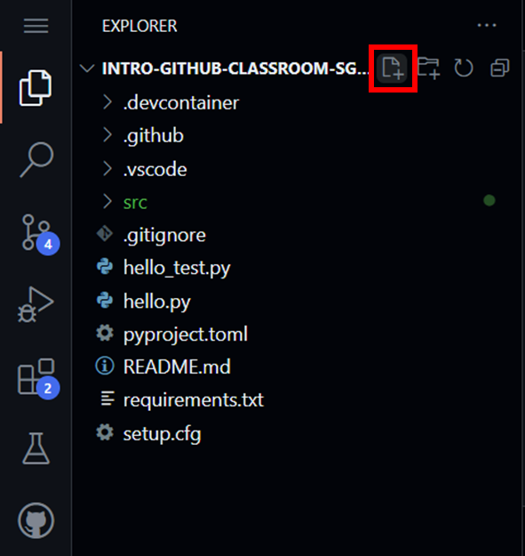
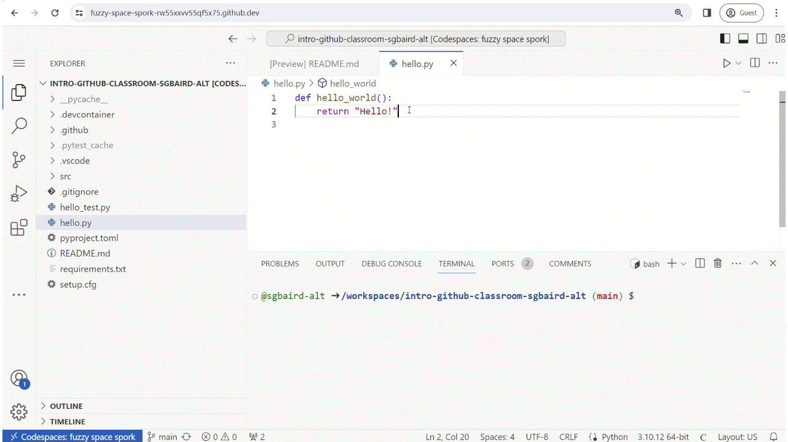
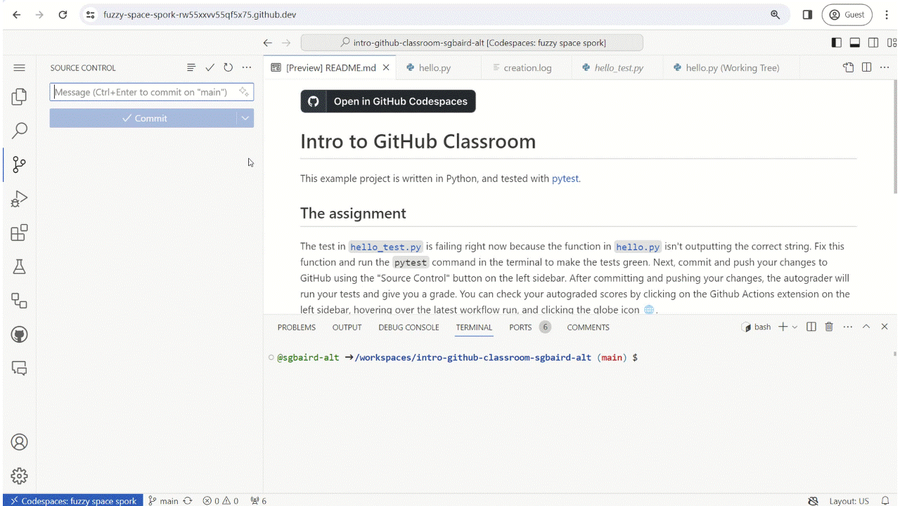

# Python Refresher

In this assignment, you'll be refreshing your Python skills by completing a series of exercises that cover the basics of Python programming. You'll be writing basic Python scripts to demonstrate your understanding of import statements, variables and data types, functions and methods, control flow statements, lists and dictionaries, modules and packages, classes and objects, file handling, error and exception handling, and string formatting.

## The assignment

The tests in [`python_refresher_test.py`](python_refresher_test.py) are failing right now. After making the appropriate changes, you can check to see if your changes are correct by running the `pytest` command in the terminal. If the tests are green, you're good to go! If not, you'll need to read the error messages, make some changes, and run the tests again.

> NOTE: To create a new file in Codespaces, click the "New File.." icon in the file explorer to the left and type the name of the file you want to create. Then, press Enter.

### 📥 Import Statements

Import statements are used to include external Python modules or libraries in a script, making their functions, classes, and variables available for use. Create a Python script named `import_example.py` that imports the `math` module and prints the value of π (pi) to the terminal using the `math.pi` constant.

### 🔠 Variables and Data Types

Variables are named locations used to store data, and data types define the kind of data a variable can hold, such as integers, strings, lists, and dictionaries. Create a Python script named `variables_data_types.py` that defines a variable `age` with an integer value of `25` and a variable `name` with a string value of `"John"`. Print each of these with Python's built-in `print` function (e.g., `print(age, name)`).

### 🧩 Functions and Methods

Functions are reusable blocks of code that perform a specific task, and methods are similar to functions but are associated with object instances or classes. Create a Python script named `functions_methods.py` that defines a function `greet` which takes a name as an argument and prints "Hello, [name]!" where `[name]` is the argument passed to the function. Call this function with the name `"Alice"`.

### 🛑 Control Flow Statements

Control flow statements, such as if-else and loops (for, while), control the execution order of code based on conditions or repeated execution. Create a Python script named `control_flow.py` that checks if a variable `number` is greater than `10`. If so, it prints "Greater than 10", otherwise "10 or less". Use `number = 8` for this example.

### 🗂️ Lists and Dictionaries

Lists are ordered collections of items, and dictionaries are collections of key-value pairs, both of which are used to store and manage data in Python. Create a Python script named `lists_dictionaries.py` that defines a list named `colors` with the values `"red"`, `"green"`, and `"blue"`, and a dictionary named `person` with keys `"name"` and `"age"` with values `"Alice"` and `30`, respectively. Print the first color in the list and the person's name from the dictionary.

### 📦 Modules and Packages

Modules are individual Python files containing reusable code, and packages are collections of modules organized in directories. Create a Python script named `modules_packages.py` that imports the datetime module, uses the `today` function from the `datetime.date` module to get today's date, and prints it in the default format "YYYY-MM-DD".

### 👥 Classes and Objects
 
Classes are blueprints for creating objects (instances), defining the properties and behaviors that the objects encapsulate. Create a Python script named `classes_objects.py` that defines a `Car` class with a method `honk` that prints `"Beep!"`. Then, create an instance of `Car` named `my_car` and call its `honk` method.

### 📁 File Handling

File handling involves reading from and writing to files, allowing data to be saved or retrieved from persistent storage. Create a Python script named `file_handling.py` that writes `"Hello, World!"` to a file named `hello.txt` and then reads the content from this file and prints it to the terminal.

### ⚠️ Error and Exception Handling

Error and exception handling involves capturing and responding to errors or exceptional conditions that occur during program execution. Create a Python script named `error_handling.py` that tries to open a file named `nonexistent.txt` for reading and catches the `FileNotFoundError`, printing `"File not found."` if the file does not exist.

### ✍️ String Formatting

String formatting involves creating strings by embedding expressions or variables within them, often using techniques like f-strings for readability and conciseness. Create a Python script named `string_formatting.py` that defines two variables, `fruit` with the value `"apple"` and `count` with the value `5`. Print a message using f-string formatting: "There are 5 apples."

## Autograding (GitHub Actions)

As a reminder, to trigger autograding through GitHub Actions within VS Code, open the "Source Control" extension on the left sidebar, write a commit message, and commit and push your changes to GitHub.

After committing and pushing your changes, the autograder will run your tests and give you a grade. First, ensure you're signed into GitHub (you will be prompted with a dialogue box). To check your autograded scores, click on the GitHub Actions extension on the left sidebar, click the refresh button at the top-right corner of the sidebar, hover over the latest workflow run, and click the globe icon 🌐. Next, click the "Autograding" job button, click the dropdown for the "Run education/autograding" step, and scroll down to see your grade.

If the GitHub Actions extension isn't working (e.g., `data provider not available`), navigate to your GitHub assignment repository directly, click on the `Actions` tab, and click on the latest workflow run. The link will be of the form `https://github.com/ACC-HelloWorld/4-hardware-software-communication-GITHUB_USERNAME`, where `GITHUB_USERNAME` is replaced with your own. For example, if your GitHub username is `sgbaird`, the link would be `https://github.com/ACC-HelloWorld/4-hardware-software-communication-sgbaird`. If you have trouble finding it, you can also use the "find a repository" search bar (boxed in red in the image below) on your [GitHub homepage](https://github.com) after signing in.

▶️ If you get stuck, refer to [the walkthrough video](https://github.com/AC-Classroom/intro-github-classroom/assets/45469701/93760bf7-0d27-49dc-8f66-7d50d428677f).